# Cargo Workspace Analyzer

A CLI tool which provides insights about
a [Cargo workspace](https://doc.rust-lang.org/book/ch14-03-cargo-workspaces.html). Currently, the following is
supported.

## Workspace Visualization

It visualizes the workspace with a [Mermaid](https://mermaid.js.org/) diagram. That way the user can see how packages
depend on each other may identify layers of the application. As an example, here is the resulting diagram a randomly
selected workspace, [Tauri](https://github.com/tauri-apps/tauri).



To have such diagram gives you the following advantages:

- a high level overview of the software you create
- gives you an idea about the degree of coupling between your packages

## Circular Dependency Detection

This analyzer finds circular dependencies. It highlights those packages, which form a circle. By running the analyzer
regularly, one can detect circular dependencies before they get hard if not impossible to resolve later on. See
this [example](https://www.mermaidchart.com/raw/35c87214-1aea-46a9-b633-8fd3bd4f90ad?theme=light&version=v0.1&format=svg).

## Metric calculations

The created graph is used to calculate common metrics in regard to the coupling of packages.
The following metric are supported:

- Afferent Coupling
- Efferent Coupling
- Instability Metric

## Package Count

It will also display the amount of packages in your workspace.

# Installation

Install it globally:

 ```sh
 cargo install cargo-workspace-analyzer
 ```

To render the Mermaid diagram and store it so disk (which is the default behaviour), you would need to have
the [Mermaid CLI](https://github.com/mermaid-js/mermaid-cli) installed as well, which run on Node.js.

```sh
npm install -g @mermaid-js/mermaid-cli
 ```

# Usage

For all details, use `cargo-workspace-analyzer --help`. However here is how you can use it generally:
Navigate to a Cargo workspace and run the tool:

 ```sh
 cd path/to/your/workspace
 cargo-workspace-analyzer
 ```

Or use an argument to specify the location of the workspace and run it from where ever you want.

 ```sh
 cargo-workspace-analyzer --working-dir /path/to/your/workspace
 ```

If you use the `--no-file` argument, the resulting [Mermaid](https://mermaid.js.org/) diagram will be printed to the
console. You can copy it for somewhere else for further processing.

<details>
<summary>Here's an example of circular dependency detection.</summary>

```
graph TD
    service-1 --> db-connector
    API --> service-2
    API --> service-1
    service-2 --> db-connector
```

</details>


