# Cargo workspace analyzer

A CLI tool which provides insights about
a [Cargo workspace](https://doc.rust-lang.org/book/ch14-03-cargo-workspaces.html). Currently, the following is
supported.

## Workspace visualization

It visualizes the workspace with a [Mermaid](https://mermaid.js.org/) diagram. That way the user can see how packages
depend on each other may identify layers of the application. As an example, here is the resulting diagram a randomly
selected workspace, [Vector](https://github.com/vectordotdev/vector).

If you use the `--no-file` argument, the resulting [Mermaid](https://mermaid.js.org/) diagram will be printed to the
console. You can copy it for somewhere else for further processing. Here a small sample:

```
graph TD
    service-1 --> db-connector
    API --> service-2
    API --> service-1
    service-2 --> db-connector
```

## Package Count

It will also display the amount of packages in your workspace.

## Roadmap

Regarding features this is still in early stage. A lot can and will be analyzed in the future. The following is
currently planed:

- [x] show how packages are related to each other
- [x] notice circular dependencies
- [x] render diagram and save a PNG file to disc
- [ ] notice dependencies which are used in multiple packages, but not declared as workspace dependency
- [ ] ability to specify layers for the diagram

## Installation

Install it globally:

 ```sh
 cargo install cargo-workspace-analyzer
 ```

Then navigate to a Cargo workspace and run the tool:

 ```sh
 cd path/to/your/workspace
 cargo-workspace-analyzer
 ```

Or use an argument to specify the location of the workspace and run it from where ever you want.

 ```sh
 cargo-workspace-analyzer --working-dir /path/to/your/workspace
 ```

For further details, use `cargo-workspace-analyzer --help`
