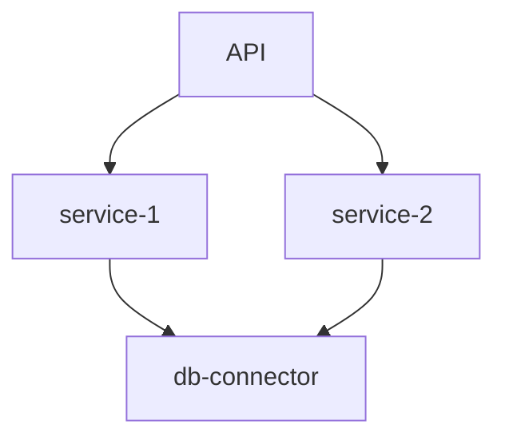

# Cargo workspace analyzer

A CLI tool which provides insights about
a [Cargo workspace](https://doc.rust-lang.org/book/ch14-03-cargo-workspaces.html). Currently, the following is
supported:

- count the number of packages within a workspace
- create a [Mermaid](https://mermaid.js.org/) diagram to show how packages depend on each other

## Installation

Install it globally:

 ```sh
 cargo install cargo-workspace-analyzer
 ```

Then navigate to a Cargo workspace and run the tool:

 ```sh
 cd path/to/your/workspace
 cargo-workspace-analyzer
 ```

or use an argument to specify the location of the workspace.

 ```sh
 cd path/to/your/workspace
 cargo-workspace-analyzer --working-dir /path/to/your/workspace
 ```

For further details, use `cargo-workspace-analyzer --help`

## Dependency analysis

After running the analyzer, an [Mermaid](https://mermaid.js.org/)  diagram is printed.

```shell
graph TD
    service-1 --> db-connector
    API --> service-2
    API --> service-1
    service-2 --> db-connector
```

You can copy it and paste it in the [Mermaid Live](https://mermaid.live/) editor. It will give you the diagram.



[//]: # ()

## Package Count

## Roadmap

Regarding features this is still in early stage. A lot can and will be analyzed in the future. The following is
currently planed:

- [x] show how packages are related to each other
- [ ] notice dependencies which are used in multiple packages, but not declared as workspace dependency
- [ ] notice circular dependencies
- [ ] ability to specify layers for the diagram